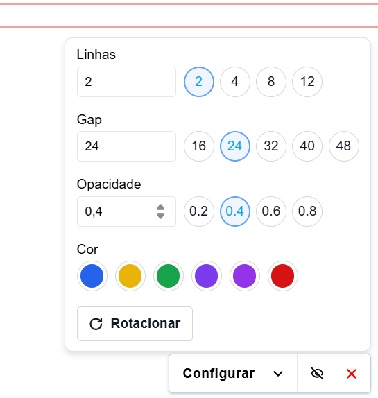

# UI Ruler - web extension

Extensão de navegador usada para medir espaçamentos entre elementos de sites (veja as imagens abaixo).

  
  

## 1 - Download e configuração (via terminal)

1. Abra seu editor de código
2. Abra o terminal e rode o comando: `git clone https://github.com/LeonardoSouzaBento/UI_Ruler-web_extension`
3. Navegue até a pasta do projeto, rode: `cd UI_Ruler-web_extension`
4. Rode `npm install`
5. Rode `npm run build`

## 2 - Instalação no navegador

1. Abra seu navegador
2. Digite na barra de endereço: chrome://extensions e dê enter
3. Habilite o modo de desenvolvedor
4. Clique em "Carregar sem compactação"
5. Selecione a pasta do repositório, depois abra/escolha a pasta `dist`

> Caso você faça alterações no código, clique no botão de recarregar a extensão, pois não é necessário apagar a extensão e instalar novamente.

> Em caso de falhas, recarregue a página.

## 3 - Como usar a extensão

1. Clique no botão com o nome da extensão, na barra de ferramentas
2. Clique no botão "Configurar" para abrir as opções, configure as linhas como desejar
3. Clique no botão de ícone "X" vermelho para desativar a extensão

### Por que essa extensão é útil?

Essa extensão é especialmente útil para desenvolvedores medirem espaçamentos entre textos e outros elementos, visto que textos não têm base ou topo bem definidos, nem mesmo com line-height=1. Além disso, outro uso pode ser para a criação de outras extensões, reaproveitando o modelo do projeto.

## Tecnologias Utilizadas

Este projeto foi desenvolvido com as seguintes tecnologias:

- **[React](https://react.dev/)**
- **[TypeScript](https://www.typescriptlang.org/)**
- **[Vite](https://vitejs.dev/)**
- **[vite-plugin-web-extension](https://vite-plugin-web-extension.aklinker1.io/)**
- **[Lucide React](https://lucide.dev/)**
- **[ESLint](https://eslint.org/)**
